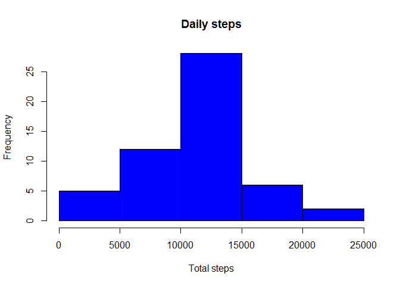
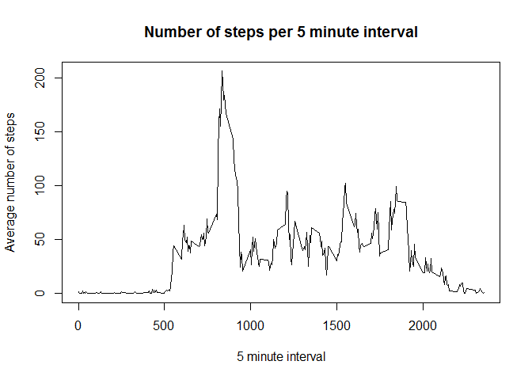
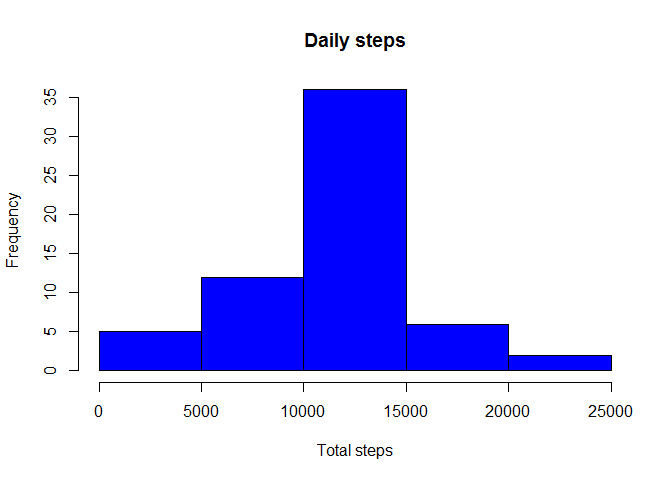
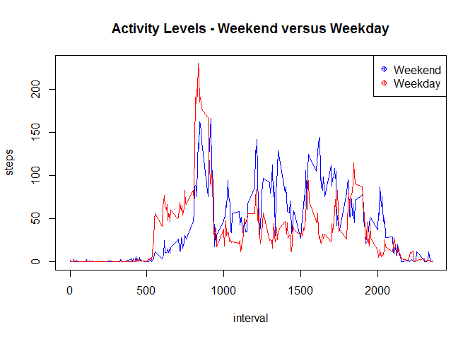

# Reproducible Research: Peer Assessment 1


Nicola McDougal
January, 10, 2016

##Introduction

This assignment makes use of data from a personal activity monitoring
device. This device collects data at 5 minute intervals through out the day. The data consists of two months of data from an anonymous
individual collected during the months of October and November, 2012
and include the number of steps taken in 5 minute intervals each day. For more information, refer to the accompanying "README.md" document.

The URL for the data can be found at https://github.com/rdpeng/RepData_PeerAssessment1

## Loading and preprocessing the data


```r
unzip("activity.zip")
activity <- read.csv("activity.csv")
```


## What is mean total number of steps taken per day?

Here, we aggregate over the intervals in each day to get a sum of daily steps. The NA values are ignored. The range of steps are shown in the histogram below. Once the aggregation is complete, the mean and the median values are calculated.


```r
meansteps <- aggregate(steps ~ date, data = activity, FUN = sum, na.rm = TRUE)
hist(meansteps$steps, col = "Blue", main = "Daily steps", xlab = "Total steps" )
```

 

You can see from the histogram that the highest bar (most frequent) occurs within 10,000 and 15,000 steps. The mean total number of steps will fall between these two values.

Both the mean and median values are calculated below:


```r
mean(meansteps$steps)
```

```
## [1] 10766.19
```

```r
median(meansteps$steps)
```

```
## [1] 10765
```

Note that both the mean and the median have na.rm = FALSE as default.

The values fall between 10,000 and 15,000 as predicted by the histogram.

## What is the average daily activity pattern?

A time series plot is shown below. It shows the average number of steps, averaged across all days for each 5 minute interval. The peack falls between the 500 and 1000th 5 minute interval.


```r
interval <- aggregate(steps ~ interval, activity, FUN = mean, na.rm = TRUE)
plot(interval, main = "Number of steps per 5 minute interval",type = "l", xlab = "5 minute interval",
     ylab = "Average number of steps")
```

 

The 5 minute interval with the maximum number of steps is calculated below:


```r
interval$interval[which.max(interval$steps)]
```

```
## [1] 835
```

This value correlates with the peak in the line plot.


## Imputing missing values

The total number of NAs can either be calculated or found in the summary function. Both ways are shown below to give a total of 2304 missing values. All the NAs are in the steps data.


```r
sum(is.na(activity))
```

```
## [1] 2304
```

```r
summary(activity)
```

```
##      steps                date          interval     
##  Min.   :  0.00   2012-10-01:  288   Min.   :   0.0  
##  1st Qu.:  0.00   2012-10-02:  288   1st Qu.: 588.8  
##  Median :  0.00   2012-10-03:  288   Median :1177.5  
##  Mean   : 37.38   2012-10-04:  288   Mean   :1177.5  
##  3rd Qu.: 12.00   2012-10-05:  288   3rd Qu.:1766.2  
##  Max.   :806.00   2012-10-06:  288   Max.   :2355.0  
##  NA's   :2304     (Other)   :15840
```

It is not known if these values will affect the results, but we can test this by imputing values for the NA value. I have used the mean values for the 5-minute intervals as substitutes for the missing values in the activity dataset.


```r
activity <- merge(activity, interval, by = "interval", suffixes = c("", 
                                                                          ".y"))
nas <- is.na(activity$steps)
activity$steps[nas] <- activity$steps.y[nas]
activity <- activity[, c(1:3)]
```

Next, the same histogram and mean and median calculations are run to look at the effect. Again the step totals are aggregated for each day.


```r
total2 <- aggregate(steps ~ date, data = activity, FUN = sum)
hist(total2$steps, col = "Blue", main = "Daily steps", xlab = "Total steps" )
```

 

```r
mean(total2$steps)
```

```
## [1] 10766.19
```

```r
median(total2$steps)
```

```
## [1] 10766.19
```

The mean remains unchanged (as expected because we are using mean values). The median value has increased very slightly to be the same as the mean. However, the effect is very small. 1 step out of 10,766 is well within error boundaries. For this dataset, ignoring NA values had an insignificant effect on the outcome of our analysis.


## Are there differences in activity patterns between weekdays and weekends?

Finally, we want to see if there are any differences in activity on the weekend compared to the weekdays. The dates are divided into two levels - weekdays and weekends. A comparison line plot is produced below.


```r
library(chron)
activity$weekend <- is.weekend(as.Date(activity$date))
days <- aggregate(steps ~ weekend + interval, activity, FUN = mean)

with(days, plot(interval, steps, main = "Activity Levels - Weekend versus Weekday", type = "n"))
with(subset(days, weekend == TRUE), points(interval, steps, type = "l", col = "blue"))
with(subset(days, weekend == FALSE), points(interval, steps, type = "l",col = "red"))
legend("topright", pch = 10, col = c("blue", "red"), legend = c("Weekend", "Weekday"))
```

 

I have chosen to overlay the plots, rather than separate them, because it shows the differences more clearly. The plot shows weekends have more activity overall. Weekends have a later activity increase (around 700th interval), which suggests that people start their weekend days at a later time. Weekends also have a small activity spike towards the end of the day; suggesting that people are up and active later compared to weekdays.
